# Ontology（本体）Part 2：Protégé 构建Ontology实战

> 此篇为构建Ontology的实战记录，内容含有大量Ontology的概念和名词，如不熟悉请先阅读第一篇 https://mp.weixin.qq.com/s/-SznuaSqg5kq5y-LcPhFwg 
主题是**如何把 Databricks 数仓里的关系型表，转换成一份可推理、可查询、可视化的 OWL 本体（Ontology），并为后续作为 LLM 的语义层做准备**。
> 数据集是微软的 AdventureWorks（经过一些简单清洗）。最终产物是一份 4201 条公理、312 个命名个体的 `.owl` 文件，可在 Protégé 中直接打开、编辑、查询。

---

## 0. 为什么要做这件事

数仓 + LLM 自然语言查询分析是 2024 年以来很热的方向，但实际落地时大家很快会遇到几个痛点：

1. **列名晦涩**：例如`onlineorderflag`、`subtotal`、`ToalDue`，LLM 没有上下文，靠猜
2. **关系散落在 SQL**：外键约束、Join 路径写在各种 SQL 视图里，LLM 看不到全貌
3. **枚举值无语义**：`status = 5` 是什么？是"已发货"还是"已取消"？需要查文档
4. **跨表推理弱**："高价值订单"、"个人客户 vs 企业客户" 这种业务概念，需要规则才能定义

直接用 ChatGPT 跑 Text-to-SQL 在 demo 阶段够用，**生产场景下精度往往很差**，根本原因是缺一份"业务语义地图"。

**本体论（Ontology）**就是为解决这个问题而生的：把业务概念、关系、约束、规则**显式建模**成机器可解析的格式。OWL（Web Ontology Language）是 W3C 标准，配套有成熟的推理器（HermiT）和编辑器（Protégé），是这个方向的事实标准。

本文路径：

```text
Databricks 数仓表
  ↓ ① 设计映射 schema
关系型 → OWL 概念的对应规则
  ↓ ② LLM 辅助生成
build_aw_ontology.py（构建脚本）
  ↓ ③ 跑脚本
aw_ontology.owl（4201 条公理）
  ↓ ④ Protégé 可视化增强
最终本体 + 推理 + 查询
```

---

## 1. 数据源与映射 Schema

### 1.1 数据源：AdventureWorks 

数据源选用目的比较明确：采用单一行业领域的数据集，数据量不需要很大但是表中主体和之间的关系要比较丰富。经过一轮简单清洗，Databricks workspace 中的有 7 张表：

| 表名 | 行数 | 业务含义 |
|---|---:|---|
| `salescustomer` | 847 | 客户 |
| `salesaddress` | 417 | 地址 |
| `salescustomeraddress` | 417 | 客户-地址关联（含地址类型） |
| `salesorderheader` | 32 | 销售订单头 |
| `salesorderdetail` | 542 | 订单明细行 |
| `salesproduct` | 295 | 产品 |
| `salesproductcategory` | 41 | 产品类目（递归层次） |

业务域：**客户 → 下订单 → 包含明细行 → 引用产品 → 属于类目（递归 4 层）**

**提示：你可以直接从我的Github中拿到Ontology文件import进Protégé熟悉操作和学习，无需自己准备数据源。**

### 1.2 核心映射规则

这是整个工程的灵魂 — 把关系型概念翻译成 OWL 元素。我们用如下规则：

| 关系型概念 | OWL 元素 | 实例 |
|---|---|---|
| 表 | `owl:Class` | `salescustomer` → `:Customer` |
| 列（非 FK） | `owl:DatatypeProperty` + xsd 类型 | `listPrice` → `xsd:decimal` |
| 外键列 | `owl:ObjectProperty` | `customerID` → `:placedBy` |
| 枚举值（status code） | `owl:NamedIndividual` | `status=5` → `:status_shipped` |
| 主键 | IRI 命名规则 | PK=29485 → `:customer_29485` |
| 复合主键 | 复合 IRI | `(SOID, PID)` → `:orderline_71782_885` |
| 中间表带额外列（M:N） | 实化为类（reification） | `salescustomeraddress` + `AddressType` → `:CustomerAddressLink` |
| 父子层次 | `:hasParentCategory` + `owl:TransitiveProperty` | `salesproductcategory.ParentProductCategoryID` |

### 1.3 NULL 处理策略

OWL 走的是**开放世界假设（OWA）**：没说的事不代表为假。这点跟 SQL 的封闭世界假设不一样，所以 NULL 要分情况：

- **DataProperty NULL → 直接不生成三元组**：例如 customer 没有 middle name，那就不要写 `:middleName ""`，否则反而引入"空字符串"这个错误事实
- **指向枚举的 ObjectProperty NULL → 显式建一个 `:unknown_xxx` 个体**：例如某产品没颜色，关联到 `:color_unknown`。这样 SPARQL 能统计"未知颜色的产品数量"

---

## 2. 项目用到的 OWL 进阶概念

> 基础概念（Class、Individual、Object Property、Data Property）请见前置博客。这里只讲做这个项目实际用到的"高级语义"。

### 2.1 FunctionalProperty — 一对一约束, 这是用到Object Property也就是Relationship的约束。

一个个体最多有一个值。例如订单的"下单人"只能有一个：

```xml
<owl:ObjectProperty rdf:about="...#placedBy">
  <rdf:type rdf:resource="http://www.w3.org/2002/07/owl#FunctionalProperty"/>
  ...
</owl:ObjectProperty>
```

类似的还有 `productName`、`listPrice`、`hasShipToAddress` 等。

### 2.2 TransitiveProperty — 递归层次，Object Property 约束。

如果 A `hasParentCategory` B、B `hasParentCategory` C，reasoner 会自动推出 A `hasParentCategory` C。我们的 `ProductCategory` 父子关系就用了它：

```xml
<owl:ObjectProperty rdf:about="...#hasParentCategory">
  <rdf:type rdf:resource="http://www.w3.org/2002/07/owl#TransitiveProperty"/>
</owl:ObjectProperty>
```

这样 `Mountain Bikes` 不仅父类是 `Bikes`，还能推出祖先是根类目。

### 2.3 inverseOf — 双向关系，Object Property 约束。

`:placedBy` 的逆是 `:placedOrder`。一旦定义了逆，reasoner 自动维护两边：写了"订单 71782 placedBy customer 29485"，就等价于"customer 29485 placedOrder 订单 71782"。

类似的成对：`hasOrderLine` ↔ `partOfOrder`、`inCategory` ↔ `containsProduct`、`refersToProduct` ↔ `soldIn`。

### 2.4 equivalentClass + Restriction — 定义类（Defined Class）

这是 OWL 最强的能力，也是 Ontology 比关系数据库强的根本所在：**写一次定义，reasoner 自动把所有符合条件的实例归类进去**。

例如 `BusinessCustomer`（企业客户）定义为"任何有 companyName 的 Customer"：

```text
BusinessCustomer ≡ Customer ⊓ ∃ companyName . xsd:string
```

加进 OWL 后，无需手动给每个客户打标签，reasoner 跑一遍，所有有 `companyName` 字段的客户**自动**变成 `BusinessCustomer` 的实例。

### 2.5 disjointWith — 互斥，Class定义约束。

`IndividualCustomer` 和 `BusinessCustomer` 不能同时是同一个客户：

```xml
<owl:disjointWith rdf:resource="...#BusinessCustomer"/>
```

如果数据矛盾（同一客户既归个人又归企业），reasoner 会报 inconsistency。这是数据质量校验的天然手段。

### 2.6 someValuesFrom / hasValue / qualifiedCardinality

三个最常用的 Restriction 类型，构造"定义类"用：

- **someValuesFrom**：`∃ companyName . xsd:string`（存在一个 string 类型的 companyName 值）
- **hasValue**：`onlineOrderFlag value true`（特定常量值）
- **qualifiedCardinality**：`SalesOrder ⊑ = 1 hasShipToAddress . Address`（每个订单**恰好**有 1 个收货地址）

### 2.7 xsd facet — 用数值范围定义类

OWL 允许用 xsd 的 facet（约束面）来构造受限数据类型。例如"高价值订单"定义为 `totalDue >= 500`：

```xml
<owl:Restriction>
  <owl:onProperty rdf:resource="...#totalDue"/>
  <owl:someValuesFrom>
    <rdfs:Datatype>
      <owl:onDatatype rdf:resource="...xsd#decimal"/>
      <owl:withRestrictions>
        <xsd:minInclusive rdf:datatype="...xsd#decimal">500.0</xsd:minInclusive>
      </owl:withRestrictions>
    </rdfs:Datatype>
  </owl:someValuesFrom>
</owl:Restriction>
```

加 reasoner 后，所有 `totalDue >= 500` 的订单都自动变成 `HighValueOrder` 的实例。

**提示：reasoner指的是在Protégé菜单栏中Reasoner选项开启HermiT推理后，对当前的Ontology的entity和公里的推理所产生的结果，这是Protégé内置的功能。**

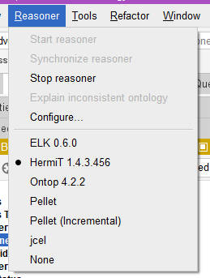

---

## 3. 用 LLM 生成初版 OWL

### 3.1 Ontology的构建是一个复杂的，繁琐的人力工程，有了大语言模型势必事半功倍！

手写 RDF/XML 极其繁琐 — 一个 Class 带双语 label + comment 就要 8 行 XML，定义 60 多个 Class、60 多个 Property、300 多个 Individual，纯手写要写到天荒地老，这也是企业构建语义层或者本体时投入大量人力和时间，令人头疼的第一大痛点。

LLM 擅长生成结构化重复内容，但**不擅长做设计决策**。所以分工：

- **人**：定决策（映射规则、IRI 命名、NULL 策略、类型选择、双语 label 等）
- **LLM**：根据决策生成代码

### 3.2 工作流 — 我选择先用"LLM 生成脚本"而非"直接吐 .owl文件"

这是个**关键决策**，值得展开讲。

```text
人定决策
  ↓
LLM 生成 build_aw_ontology.py（Python rdflib 脚本）
  ↓
准备 sample_data/*.json（Ontology Individual对应的实际数据value样本）
  ↓
python build_aw_ontology.py
  ↓
aw_ontology.owl
```

**脚本化可以带来后期运维的诸多优势。我这里的脚本只是个示例，在企业中可能维护起来更庞大，同样也可以选择直接在Protégé图形化的形式维护，或者两者相结合**：

1. **可重复（Reproducible）**：脚本可以反复跑，输入数据变了就重跑，不像手改 XML 容易出错
2. **可维护（Maintainable）**：Python 函数 `add_class(...)` / `add_op(...)` 比 8 行嵌套 XML 易读 10 倍
3. **可版本化（Diff-friendly）**：脚本的 git diff 一目了然，RDF/XML 的 diff 几乎不可读
4. **可测试（Testable）**：能写单元测试验证三元组数量、特定 axiom 是否生成
5. **可扩展（Extensible）**：加新 Class 改一行函数调用，不用动 XML 模板
6. **数据驱动**：JSON 抽样独立于建模，让 Ontology 结构与具体数据样本解耦

> 在我的 repo 里，原始数据是用 Databricks MCP 抽样后存为 7 个 JSON 的，整个数据样本 + 脚本 + OWL 文件我放到 GitHub 请自取：https://github.com/tianputao/AW_Sample_Ontology

### 3.3 关键代码片段

辅助函数把模板化操作封装好了，使用起来非常清爽：

```python
# 定义一个类（含双语 label/comment）
add_class("Customer", "Customer", "客户",
          "A person or business that places orders.",
          "下订单的个人或企业。")

# 定义一个 FunctionalProperty
add_op("placedBy", "placed by", "下单人",
       "The Customer who placed this Sales Order.",
       "下此销售订单的客户。",
       domain="SalesOrder", range_="Customer", functional=True)

# 定义一个 DataProperty 带单位注解
add_dp("listPrice", "list price", "标价",
       "List price in USD.", "标价（美元）。",
       domain="Product", range_=XSD.decimal,
       functional=True, unit="USD")
```

定义"等价类"（让 reasoner 做推理）也只有几行：

```python
# HighValueOrder ≡ SalesOrder ⊓ (totalDue >= 500.0)
hv_dt = BNode()
g.add((hv_dt, RDF.type, RDFS.Datatype))
g.add((hv_dt, OWL.onDatatype, XSD.decimal))
# ... withRestrictions: xsd:minInclusive 500.0
r_hv = restriction("totalDue", "someValuesFrom", hv_dt)
equivalent_class("HighValueOrder", [to_iri("SalesOrder"), r_hv])
```

> 完整脚本会随这篇博客一起放 GitHub repo，文末附链接。

### 3.4 验证：跑脚本，看统计

跑完后，rdflib 序列化为 `aw_ontology.owl`，并在 stdout 打印统计：

```text
✅ Wrote aw_ontology.owl
   Classes              : 58
   Object Properties    : 18
   Data   Properties    : 43
   Annotation Properties: 4
   Named Individuals    : 312
   Total triples        : 4270
```

跟设计预期一致 — 58 个类（6 个核心 + 6 个枚举 + 41 个产品类目子类 + 5 个定义类）、18 个 ObjectProperty、43 个 DataProperty、312 个 Individual。

---

## 4. 导入 Protégé 做可视化增强

把 `aw_ontology.owl` 用 Protégé 打开，立刻能看到结构化的本体全貌。下面我们看几个最常用的面板。

> Protégé 的介绍和意义请阅读前置文章。

### 4.1 Protégé 面板巡礼

#### Active ontology — 本体头部和指标

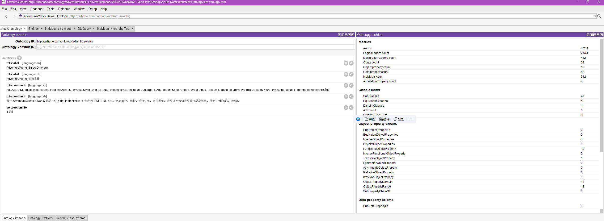

左边是本体 IRI、双语 label、comment 和版本号；右边 **Ontology metrics** 是关键 — 一眼看到全局统计：

- Axiom 4,201（公理总数）
- Class count 58
- Object property count 18
- Data property count 43
- Individual count 312
- TransitiveObjectProperty 1
- FunctionalObjectProperty 12

#### Classes — 类层次和可视化

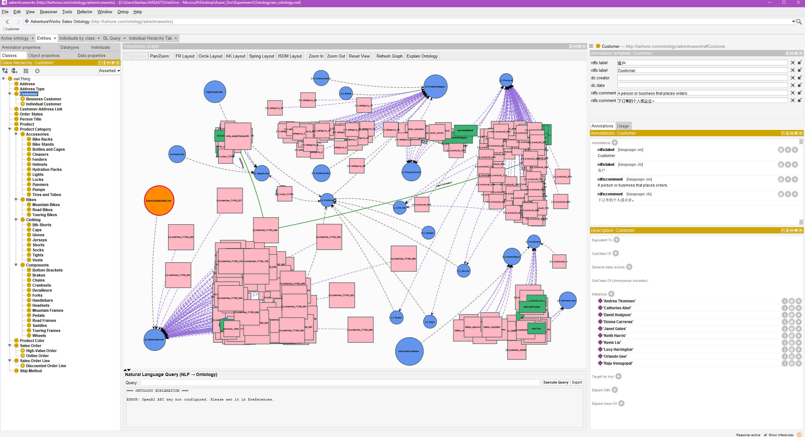

左侧 `Class hierarchy` 是树形结构，能看到：

- `Customer` 下挂了 `BusinessCustomer` / `IndividualCustomer`
- `Product Category` 下展开了完整的 4 层树（Bikes → Mountain/Road/Touring Bikes；Clothing → Bib-Shorts/Caps/...；Accessories → Bike Racks/Bottles and Cages/...；Components → Bottom Brackets/Brakes/...）
- `Sales Order` 下挂了 `High-Value Order` / `Online Order`
- `Sales Order Line` 下挂了 `Discounted Order Line`

右侧 `Graph` 是可视化版的类层次图。这里我安装使用了github中Vishal Mysore开发的插件：https://github.com/vishalmysore/vidyaastra-protege-plugin 

#### Object Properties — 对象属性

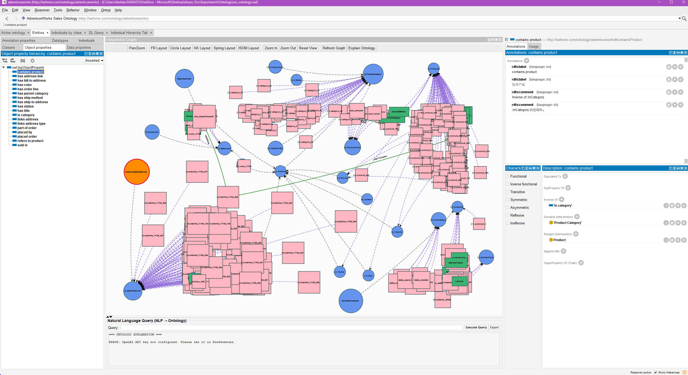

左侧列出 18 个对象属性（`contains product`、`has address link`、`has color`、`has parent category` 等）。右侧选中 `contains product` 时，可看到它的 **inverse of "in category"**、domain 是 `Product Category`、range 是 `Product`。

#### Data Properties — 数据属性

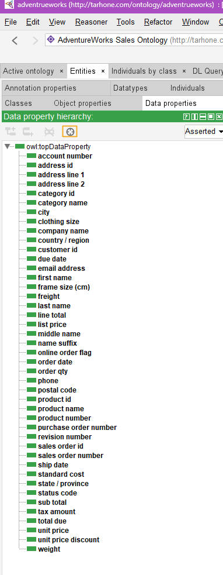

43 个数据属性都在这里，包括 `account number`、`address line 1/2`、`city`、`due date`、`list price`、`order qty`、`product name`、`weight` 等。每个都带了 domain（属于哪个类）和 range（什么 xsd 类型）。数据属性你可以理解成结构化表中的列名，但是并不是需要把你所有数据源中的列名都需要构建成Ontology的数据属性，只针对有价值和对实际数据有意义的列名转成数据属性即可。

#### Datatypes — 可用的数据类型

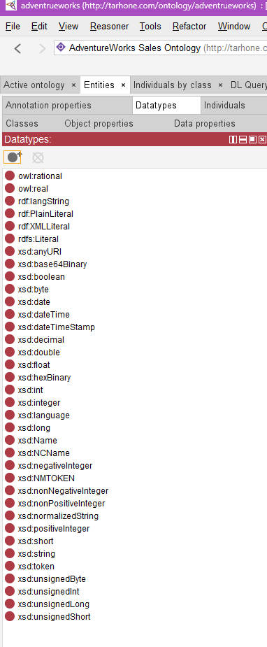

这个面板展示了 Protégé 支持的所有 xsd 数据类型 — `xsd:boolean`、`xsd:date`、`xsd:dateTime`、`xsd:decimal`、`xsd:double`、`xsd:integer`、`xsd:string` 等等。**第 4.2 节会用到**：手动调整 Data Property 的 range 时就从这里挑。

#### Individuals — 所有命名个体

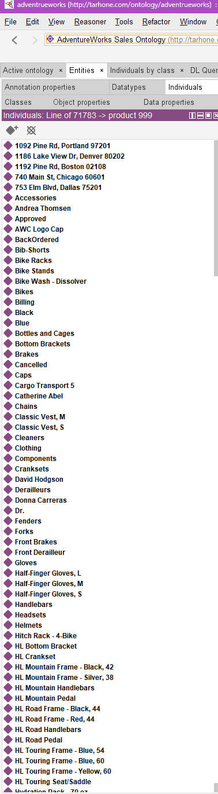

312 个个体的扁平列表 — 地址（`1092 Pine Rd, Portland 97201`...）、客户（`Andrea Thomsen`、`Catherine Abel`...）、类目（`Accessories`、`Bikes`...）、订单（`SO71782`...）、产品（`AWC Logo Cap`、`Bike Wash - Dissolver`...）等等。实际上在Ontology中classs对应的实例（instance）就是这个individual, 每个individual实际上就是结构化数据表中的真实value，数据量不大的情况下可以把所有value摄取，但其实对于增强查询意义来说是没有必要的。一般都是采用抽样的形式，摄取极小部分数据即可。

#### 如果你想直观的查看个体之间的关系，Individuals by class — 按类查看个体是最常用的

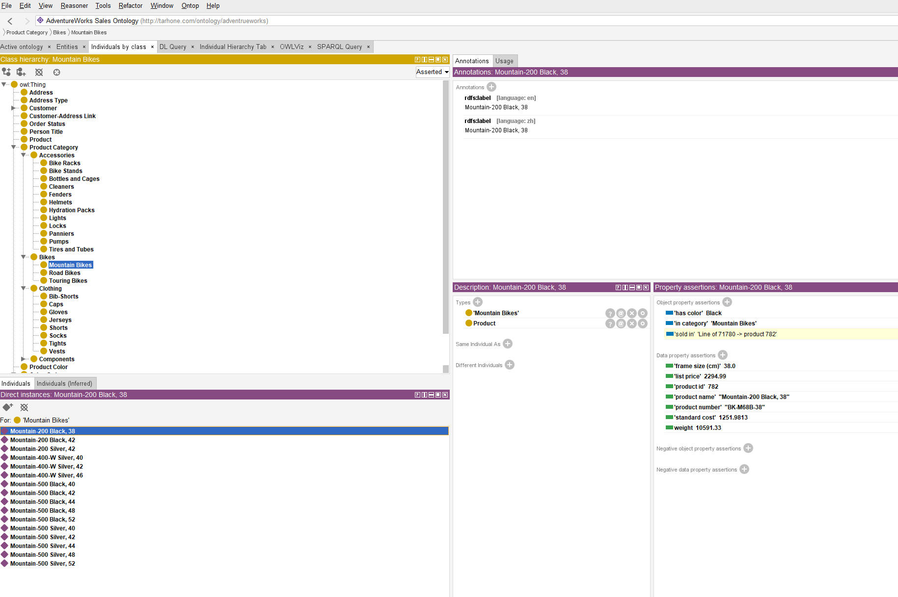

例如：左侧选 `Mountain Bikes` 类，下方"Direct instances"列出 13 个山地车实例。点 `Mountain-200 Black, 38`，右侧立刻显示这个产品的所有信息：

- **Types**: Mountain Bikes、Product
- **Property assertions**:
  - has color: Black
  - in category: Mountain Bikes
  - sold in: Line of 71780 → product 782
  - frame size (cm): 38.0
  - list price: 2294.99
  - product name: "Mountain-200 Black, 38"
  - standard cost: 1251.9813
  - weight: 10591.33

这一个面板就把"产品 + 所属类目 + 属性 + 谁卖了它"完整串起来了。

#### OntoGraph — 关系图

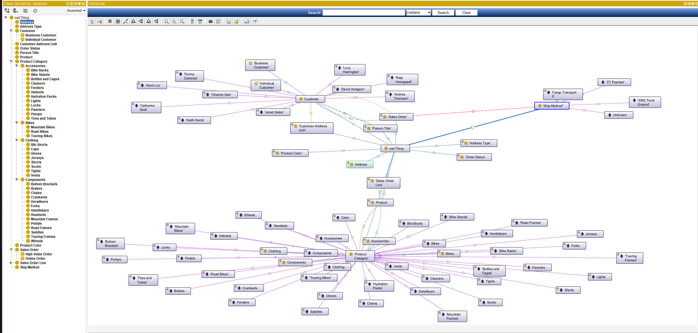

OntoGraph 插件以图的形式展示类与个体之间的关联，例如：每个客户连到 `Customer` 类，订单连到 `Sales Order` 类，产品类目通过 `has parent category` 互相串联。适合给业务人员讲 Ontology 整体结构。

### 4.2 手动增强示例：调整类型映射

LLM 生成脚本时，对某些字段的 xsd 类型可能选得不够精准 — 比如把货币也放成 `xsd:double`，或者忘了把日期标成 `xsd:date`。这种"微调"很适合在 Protégé 里手动改，然后回写到脚本。

**核心决策原则**：

| 业务场景 | 推荐 xsd 类型 | 理由 |
|---|---|---|
| 货币、税额、价格、数量 | `xsd:decimal` | **精确**（任意位数），不会浮点丢精度，对 reasoner 数值推理友好 |
| 不要用 | ~~`xsd:double`~~ | IEEE 754 浮点，`19136.1375` 可能被存成 `19136.137499999998`，比较时出错 |
| ID、订单号、count | `xsd:integer` | 任意精度整数 |
| 日期（仅日期） | `xsd:date` | 例如 `orderDate` |
| 日期+时间 | `xsd:dateTime` | 例如 `shipDate` |
| 布尔标志位 | `xsd:boolean` | 例如 `onlineOrderFlag` |
| 自由文本 | `xsd:string` | 名字、电话、地址行等 |

**在 Protégé 里手动调整 range**：

1. 切到 **Data Properties** 面板
2. 左侧选中要改的 Property（比如某个 price 字段）
3. 右下角 **Range** 区域，点 ⊕ 添加 /  编辑
4. 在弹出的 Datatypes 列表里挑 `xsd:decimal`
5. Save

**重要提醒**：在 Protégé 里改完之后，**一定要把修改回写到 `build_aw_ontology.py`**，否则下次重跑脚本，改动就被覆盖了。如果是直接在 Protégé 中维护，你同样可以另存为OWL语法格式的文本文件，方便在其他软件或者脚本的形式展示和使用你的Ontology。这一点很重要，这也是我下期文章利用LLM结合语义层进行数据分析的方案。实际上这个OWL文件在一定的使用方式下就是语义层。目前 Protégé 是不能直接作为动态数据层接入到你的Agent中的。

### 4.3 其他典型的手动增强

除了调类型，Protégé 里还可以做这些事：

- **补充双语 label / comment** — 提升业务可读性
- **调整类层次** — 比如新发现某个产品类目应该归到另一个父类
- **加 `disjointWith`** — 标记几个类互斥，让 reasoner 做一致性检查
- **加新的 `equivalentClass`** — 比如定义 "VIP 客户 = 下过至少 3 个高价值订单的客户"
- **启动 HermiT reasoner** — 看推理出的新事实（如某些客户被自动归类为 `BusinessCustomer`）

等等，还有很多。这里在实际生产中工作量取决于数据entity的量和复杂度，可以循序渐进，不断的维护和更新才能达到一个满意而准确的状态。

---

## 5. 查询和验证 Ontology

Ontology 装好之后，最直观的验证方法就是查询。Protégé 提供两种主要方式：**DL Query**（描述逻辑表达式）和 **SPARQL**。如果你找不到这两个tab,需要你在菜单Window的Tabs中勾选上。

### 5.1 DL Query 实战：高价值订单

**场景**：找出所有 `totalDue > 10000` 的订单。

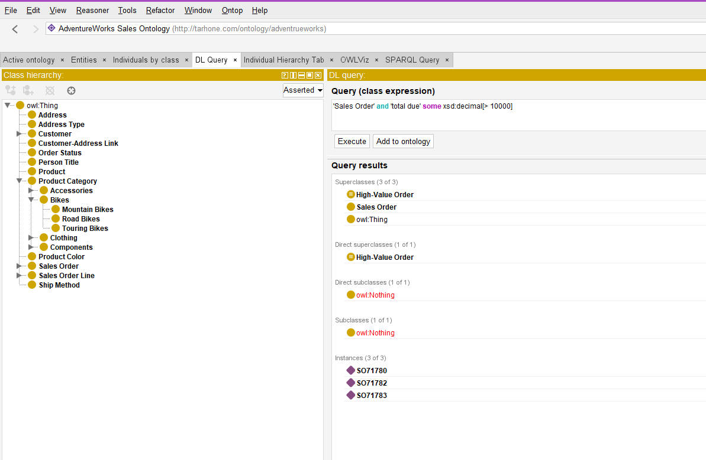

在 DL Query 标签输入：

```text
'Sales Order' and 'total due' some xsd:decimal[> 10000]
```

查询需要启动 HermiT reasoner。勾选 Instances、点 Execute，结果立刻返回 3 个订单：**SO71780、SO71782、SO71783**。

但更优雅的做法是直接查我们提前定义好的 `High-Value Order` 类：

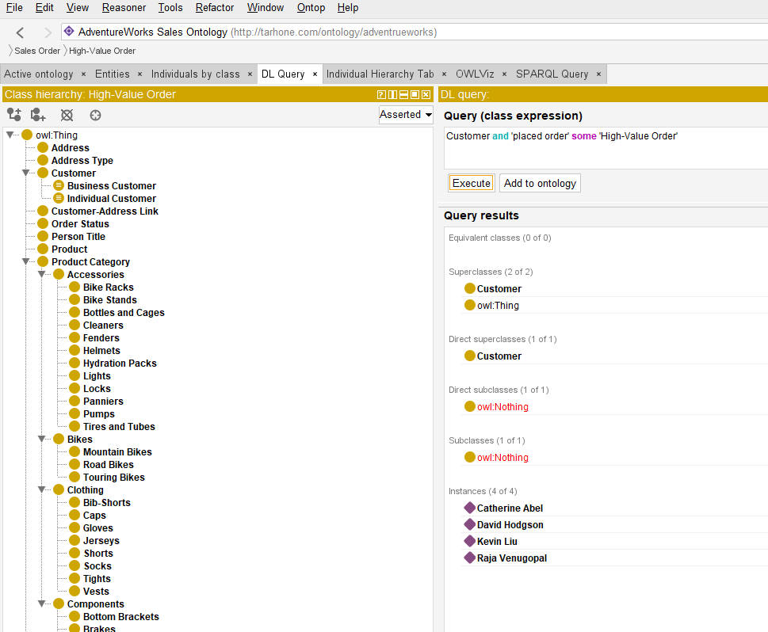

```text
Customer and 'placed order' some 'High-Value Order'
```

这是个跨关系链的查询 — "下过高价值订单的客户"。Reasoner 返回 4 个客户：**Catherine Abel、David Hodgson、Kevin Liu、Raja Venugopal**。

**关键洞察**：第二个查询里出现的 `High-Value Order` 是我们在第 2.4 节定义的"等价类"。我们**没有**在数据里手动给任何订单打"高价值"标签，是 reasoner 根据"totalDue ≥ 500"的定义自动分类的。这就是 Ontology 比关系数据库强的核心地方 — **业务规则一次定义，自动应用到所有数据**。

### 5.2 SPARQL 实战：最贵的自行车排序

**场景**：列出所有自行车（含山地车、公路车、旅行车）按价格降序排列。

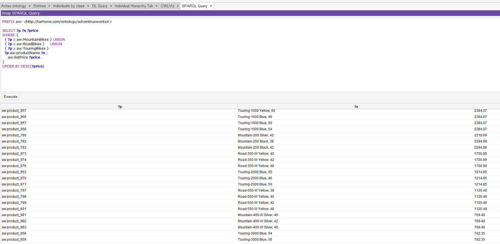

SPARQL 查询：

```sparql
PREFIX aw: <http://tarhone.com/ontology/adventrueworks#>

SELECT ?p ?n ?price
WHERE {
  { ?p a aw:MountainBikes } UNION
  { ?p a aw:RoadBikes }     UNION
  { ?p a aw:TouringBikes }
  ?p aw:productName ?n ;
     aw:listPrice ?price .
}
ORDER BY DESC(?price)
```

结果按价格降序排列：

| 产品 | 名称 | 价格 (USD) |
|---|---|---:|
| Touring-1000 Yellow, 60 |  | 2384.07 |
| Touring-1000 Blue, 46 |  | 2384.07 |
| Touring-1000 Blue, 50 |  | 2384.07 |
| Touring-1000 Blue, 54 |  | 2384.07 |
| Mountain-200 Silver, 42 |  | 2319.99 |
| Mountain-200 Black, 38 |  | 2294.99 |
| Mountain-200 Black, 42 |  | 2294.99 |
| Road-350-W Yellow, 40 |  | 1700.99 |
| ... | | ... |


## 6. 总结

### 5 步动手清单

构建Ontology的最小路径是：

1. **挑数据源** — 任何关系数据库的表，尽量不同业务数据之间有些关联。前提最好有些数据的治理，不能用本体来直接替代数据治理，这是不同的概念和场景。
2. **设计映射规则** — 参考本文第 1.2 节的表格
3. **写一个 rdflib Python 脚本** — 用 LLM 辅助生成，把决策映射成代码。当然脚本也不是必须的，可以直接生成OWL的基础文件。
4. **跑脚本生成 .owl** — 用 Protégé 打开验证，可视化编辑，增强，精准化。
5. **启动 HermiT reasoner + DL Query/SPARQL** — 验证业务规则被正确推理和编辑。

### 适合的场景

- ✅ 业务概念**稳定且复杂**，需要长期维护
- ✅ 跨数据源解释（数仓 + 业务系统 + 文档），需要统一语义层
- ✅ 有 LLM/AI Agent 二次消费需求，希望模型"理解"业务而非猜测不了解的schema，和数据关系
- ✅ 业务数据多跳问答
- ✅ 需要自动一致性检查、业务规则推理

### 不适合什么场景

- ❌ 纯 OLAP 报表（直接 SQL + BI 工具够用）
- ❌ 低延迟 OLTP（OWL 推理有性能开销）
- ❌ Schema 高频变化的探索性分析

## 附录

- 📦 完整代码 + 数据 + OWL 文件：https://github.com/tianputao/AW_Sample_Ontology
- 📖 前置阅读：https://mp.weixin.qq.com/s/-SznuaSqg5kq5y-LcPhFwg
- 📖 Protégé 文档：https://protegewiki.stanford.edu/wiki/Main_Page
- 📖 Protégé Graph插件：https://github.com/vishalmysore/vidyaastra-protege-plugin
- 📅 下一篇预告：利用 Ontology（本文中的OWL）作为语义层，增强对结构化数据的数据分析和挖掘。

---

*本文使用的工具版本：Protégé 5.x（桌面版） · HermiT reasoner · rdflib 7.x · Python 3.12 · Databricks Runtime 14.x*
